# Servidor de automatización IC/DC Jenkins
---
# INSTALAR JENKINS

En la página de `Jenkins`  https://www.jenkins.io/doc/book/installing/linux/#debianubuntu podemos ver el proceso de instalación de Jenkins en distribuciones debian. `Jenkins` necesita `java 21` para funcionar.

1. Comprueba si tienes **java 21 o superior** y sino, instalarlo. También necesitamos instalar **Java 11** para compilar el proyecto Store-APP.

```bash
# actualizamos repositorios
sudo apt update
# instalamos java 11 para maven
sudo apt install openjdk-11-jdk
# instalamos dependencias y java 21
sudo apt install fontconfig openjdk-21-jdk
# comprobamos versión de java 
java --version
# Comprobamos que tenemos versión al menos 21
```
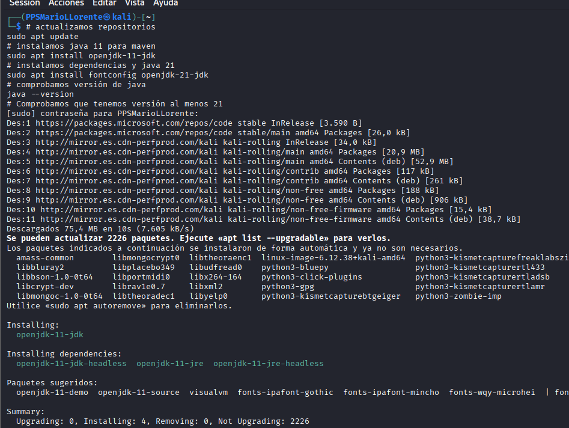

Si tienes instalada java 21 pero tienes activada una versión inferior, p.e. de la realización de actividades anteriores podemos cambiar versión de java con `update-alternatives`:

```bash
update-alternatives --config java
# seleccionamos  java 21 o 25
update-alternatives --config javac
# seleccionamos java 21 o 25
```
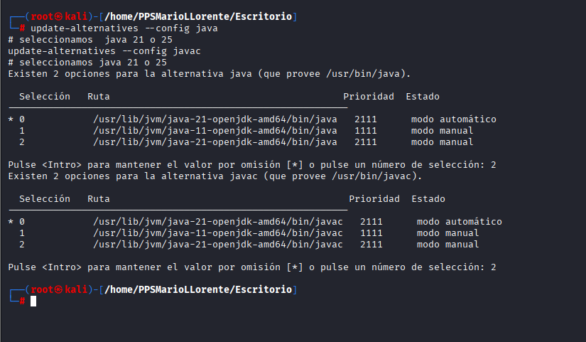

2. **Descarga claves** de Jenkins, las añadimos, **crea** el archivo con el **repositorio** e **instala**.

```bash
# Descargamos clave 
sudo wget -O /etc/apt/keyrings/jenkins-keyring.asc https://pkg.jenkins.io/debian-stable/jenkins.io-2026.key
# creamos source jenkins
echo "deb [signed-by=/etc/apt/keyrings/jenkins-keyring.asc]" https://pkg.jenkins.io/debian-stable binary/ | sudo tee /etc/apt/sources.list.d/jenkins.list > /dev/null
# actualizamos repositorios
sudo apt update
# instalamos jenkins
sudo apt install jenkins    
```
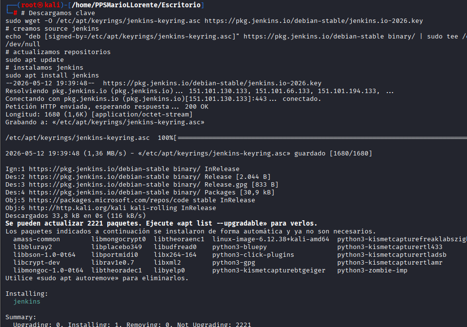

3. **Arrancar `Jenkins`**

```bash
systemctl start jenkins 
```
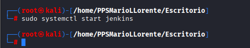

4. **Accedemos**: http://localhost:8080

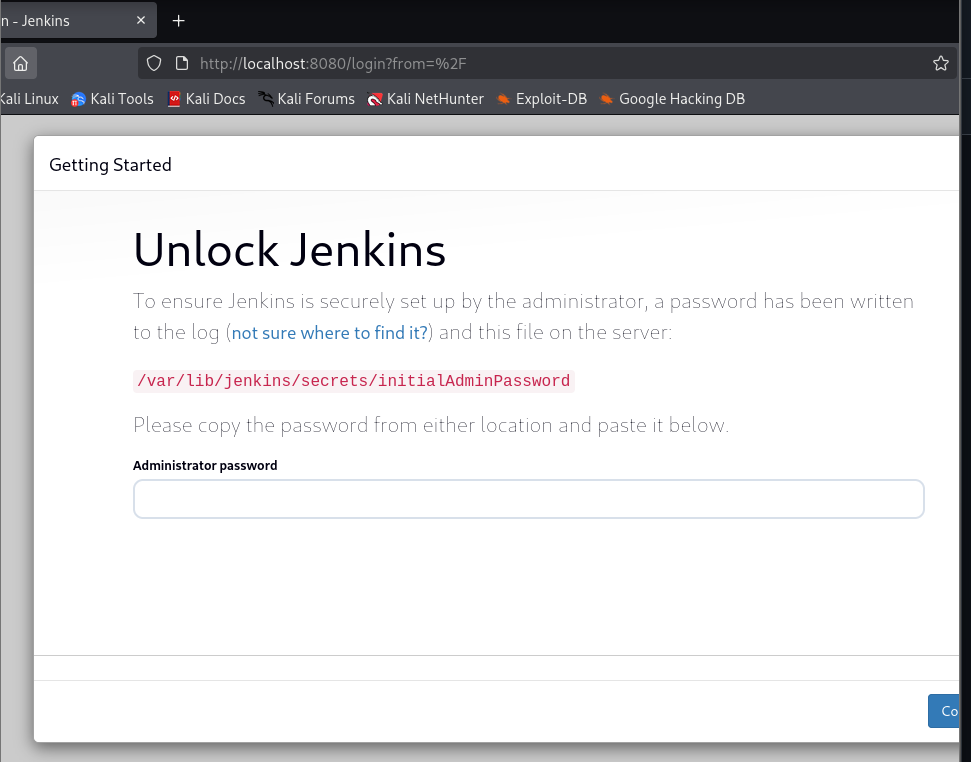

Tenemos que introducir el password inicial de administrador, por lo que lo obtenemos del archivo:

```bash
cat /var/lib/jenkins/secrets/initialAdminPassword
```
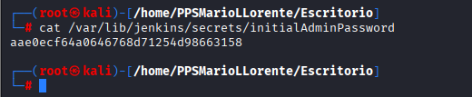

5. **Copiamos el código** de administrador y pulsamos el botón **continue**.

6. **Instalamos los plugins sugeridos**.

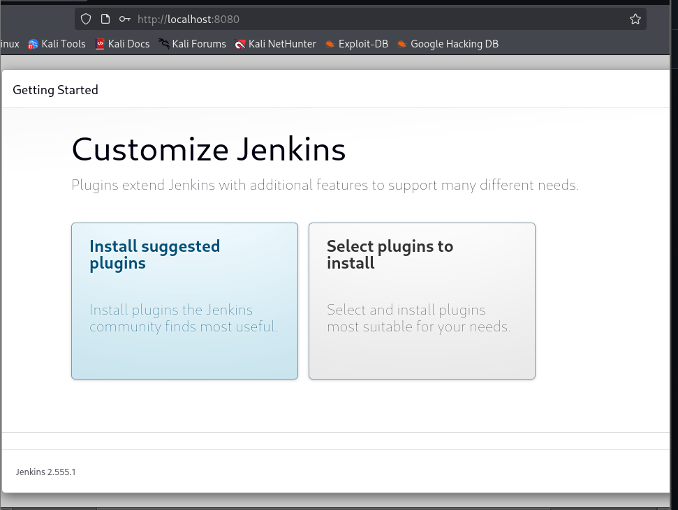

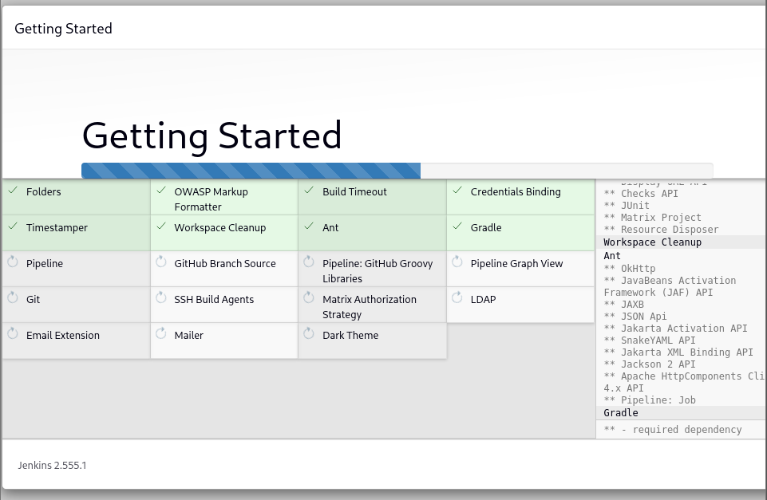

# AÑADIR CREDENCIALES 

Para vincular `Jenkins` con un proyecto de `GitHub.com` lo habitual es no “conectar la cuenta” completa, sino dar a Jenkins acceso al repositorio mediante la URL del repo y, si es privado, unas credenciales o un token.

Para ello lo primero es crear un token en `GitHub.com`:

1. Ir a **Github.com > Nuestro Usuario > Settings > Developer Settings (La última de las opciones) > Personal access token** 

2. Pulsamos en **Personal access tokens** y podremos pulsar en **Tokens (Classics)**

3. Pulsamos botón de **Generate new token/Tokens(classic)**.

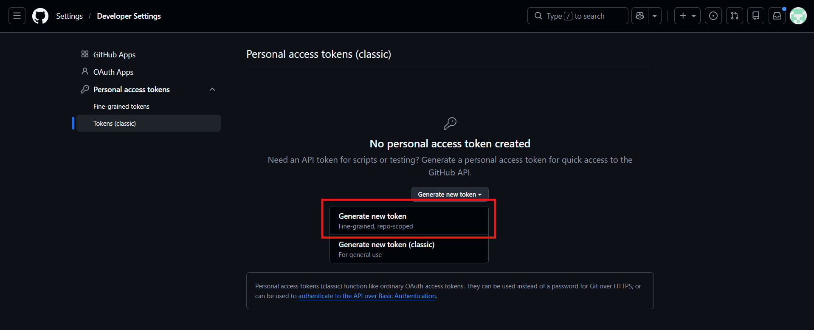

4. **Rellenamos**:
- Nombre de token (Note).
- Expiration
- Hacemos check en los permisos que queramos conceder

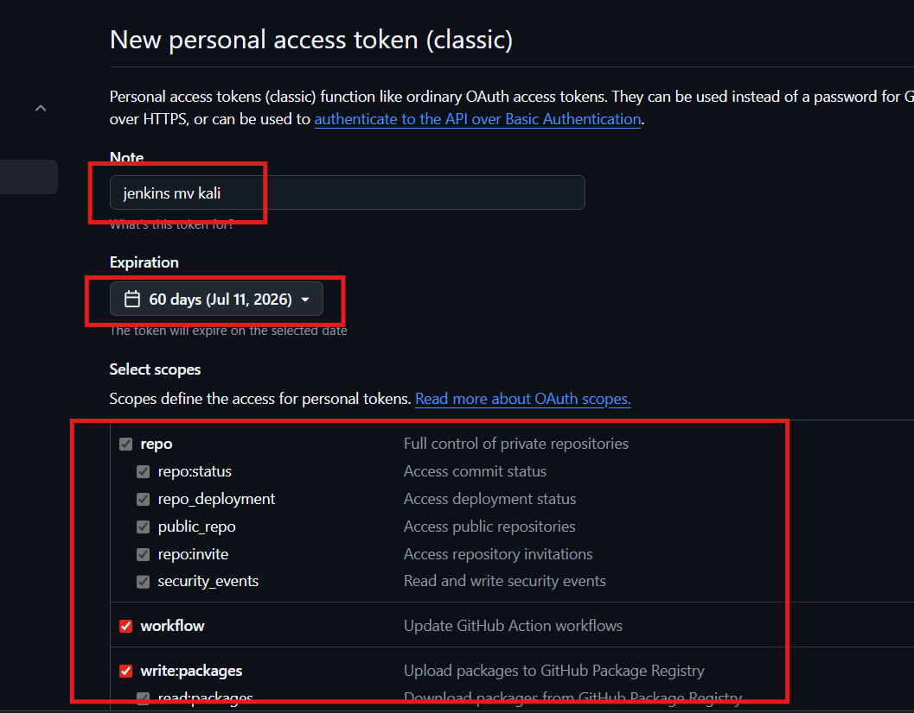

5. Pulsamos en botón **Generate token**.

6. **Copiamos el token** por que no podremos volver a copiarlo. Si lo olvidamos tendremos que generar otro.

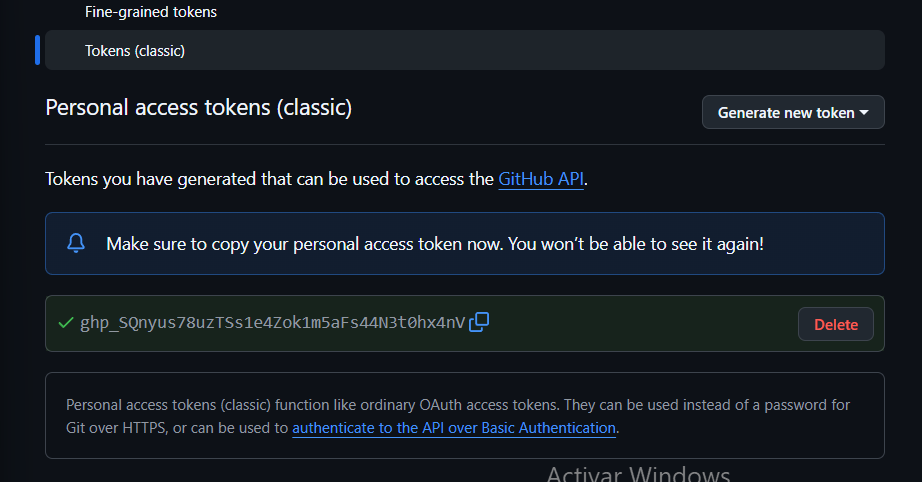

Una vez copiado el token, vamos a **añadirlo a jenkins**

7. Ir a **Administrar Jenkins > Security > Credentials > System > Global credentials > Add Credentials**.

8. Seleccionar **Username with password**

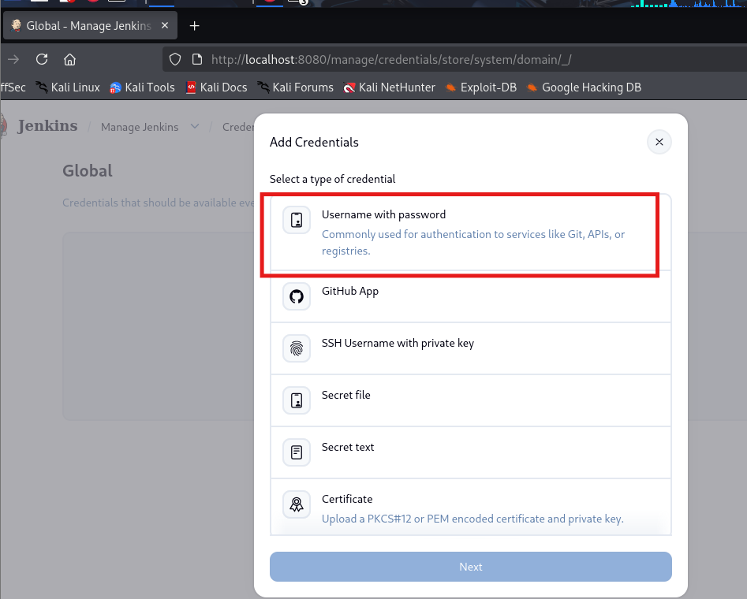

9. Introducimos en **Username**  nuestro **usuario de GitHub.com** y en **Password** el **token** que hemos generado. Importante en `ID` vamos a colocar un nombre de ID descriptivo (y seguro), que tendremos que utilizar en nuestro `Jenkinsfile`.

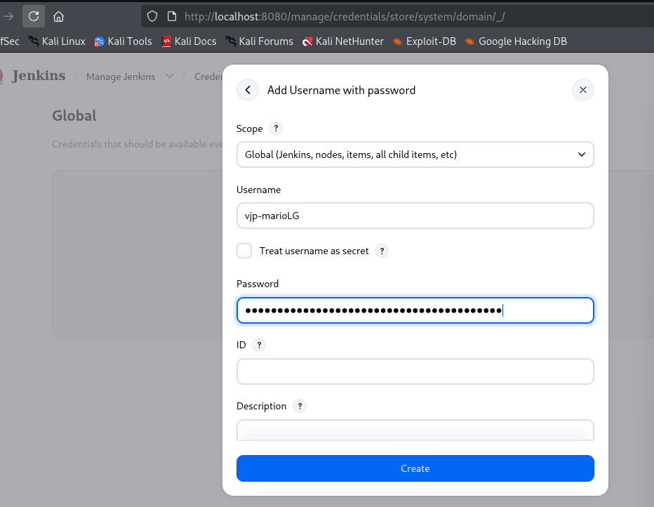

10. Pulsamos el botón **Create**.

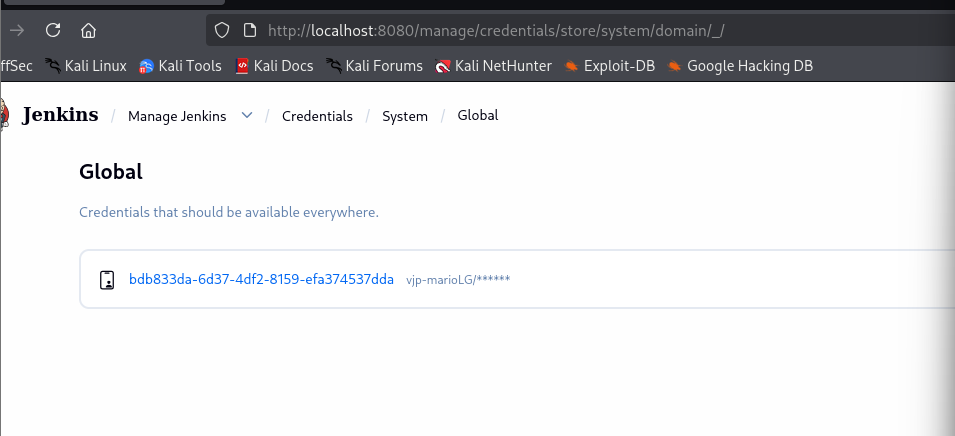

11. Guardamos el id de ese token, ya que desde hace poco tiempo, tenemos que introducirlo también en el campo     **`credentialsId:`** en los scripts de los `pipeline` que creemos. y


---
# CREAR REPOSITORIO STORE-APP

1. Crea en `GitHub.com` tu repositorio con nombre store-app-TuNombre o bien localiza el que tienes ya creado en tu organización.

- **Si has creado un repositorio nuevo:**
2. Crea una carpeta en tu equipo local.
3. Copia allí la app store-app.zip
3. Clona el repositorio.
4. Descomprime store-app en la carpeta.
5. Mueve los archivos al directorio del repositorio.

```bash
git clone http://github.com/$Tu_usuario_git/app-store-$Tu_nombre
cd store-app-Tu_nombre
# copiar ahí store-app.zip
unzip store-app.zip
mv store-app/* ../
rm -rf store-app*
```
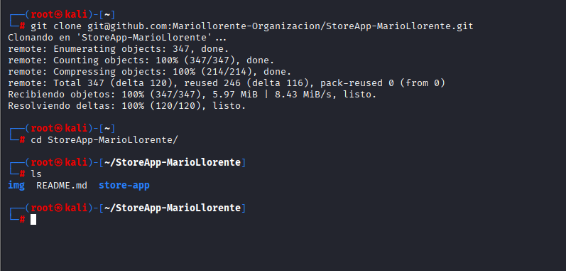
---
# CREAR PRIMER PROYECTO: CLONAR EL REPOSITORIO

1. Vuelve a la página principal y pulsa sobre **nueva tarea**.

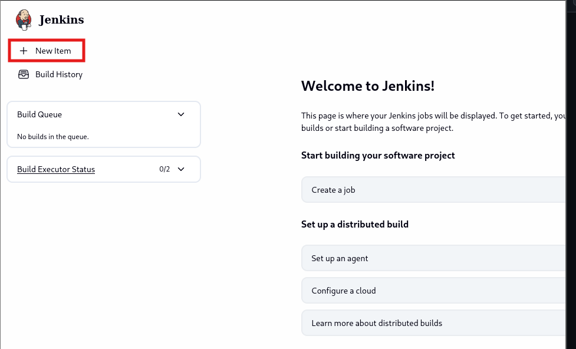

2. Ponle el nombre **StoreAPP-TuNombre** y pulsa en **Pipeline** y en botón **OK**.

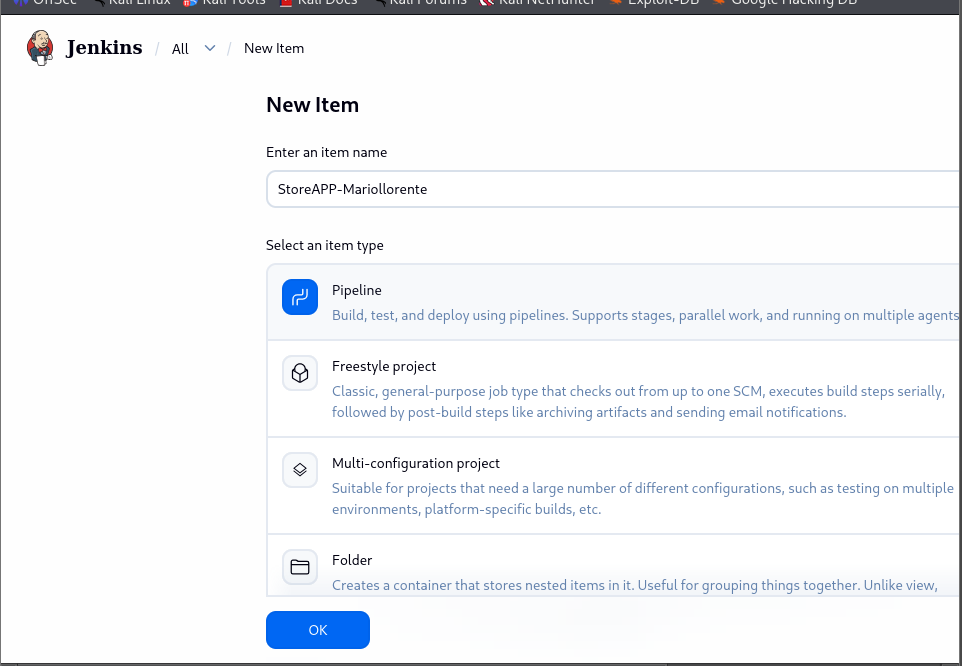

3. Ponemos en script el siguiente:

```groovy
pipeline {
    agent any  // Indica que Jenkins puede ejecutar este pipeline en cualquier nodo disponible

    stages {   // Bloque que agrupa las distintas fases del proceso (pipeline)

        stage('Clonar repositorio') {  // Primera fase: descargar el código fuente
            steps {  // Conjunto de acciones que se ejecutan dentro de este stage

                // Clona el repositorio Git especificado
                // - branch: rama que se va a descargar
                // - url: dirección del repositorio
                git branch: 'main',
                url: 'https://github.com/Mariollorente-Organizacion/StoreApp-MarioLlorente.git',
                credentialsId: 'bdb833da-6d37-4df2-8159-efa374537dda'
            }
        }

        stage('Verificar contenido') {  // Segunda fase: comprobar que todo se ha clonado bien
            steps {

                // Muestra un mensaje en consola
                sh 'echo "Repositorio clonado correctamente"'

                // Muestra el directorio actual de trabajo
                sh 'pwd'

                // Lista los archivos del directorio con detalle
                sh 'ls -la'

                // Muestra las ramas disponibles en el repositorio
                sh 'git branch -a'
            }
        }
    }
}
```

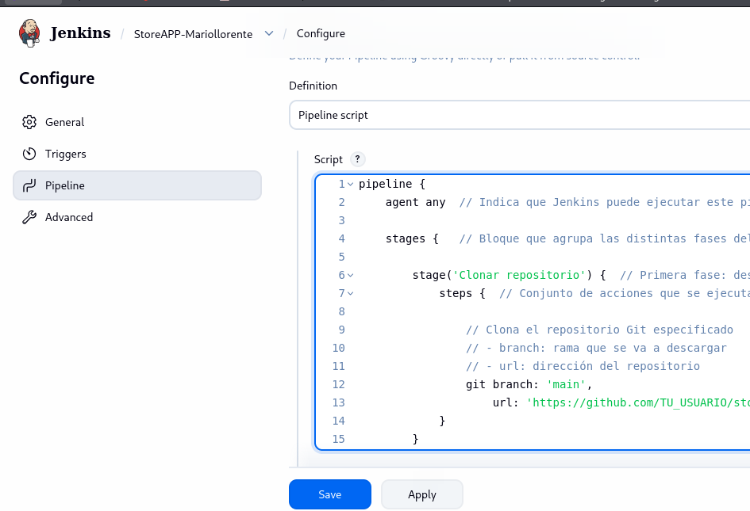


> **ANÁLISIS DE LA SINTAXIS DEL PIPELINE**
>
> Los **stages (etapas)** son las fases lógicas del **pipeline**. Sirven para organizar el proceso en bloques claros.
> En cada **`pipeline`** podemos encontrarnos varias `stages`.
>
> Los **steps (pasos)** son las acciones concretas que se ejecutan dentro de un `stage`. Es habítual que cada `stage` se componga de varios `steps`.
>

4. **Ejecutar** pulsando botón **Construir ahora**.

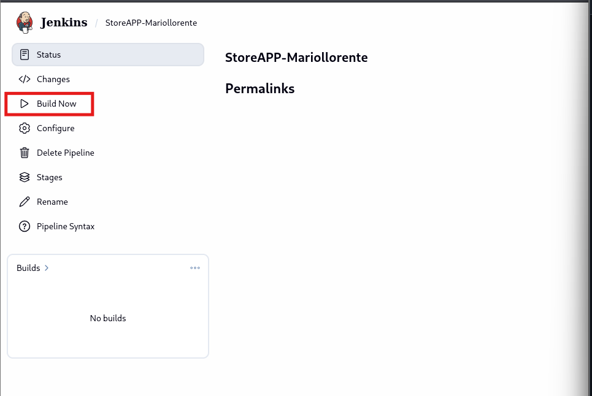


En la parte inferior izquierda nos aparece el resultado de la ejecución. En este caso, correcta.


# ANÁLISIS DE LA EJECUCIÓN

## Información de Tareas

Si vamos a la página principal <http://localhost:8080> vamos a ver las `tareas` ejecutadas:

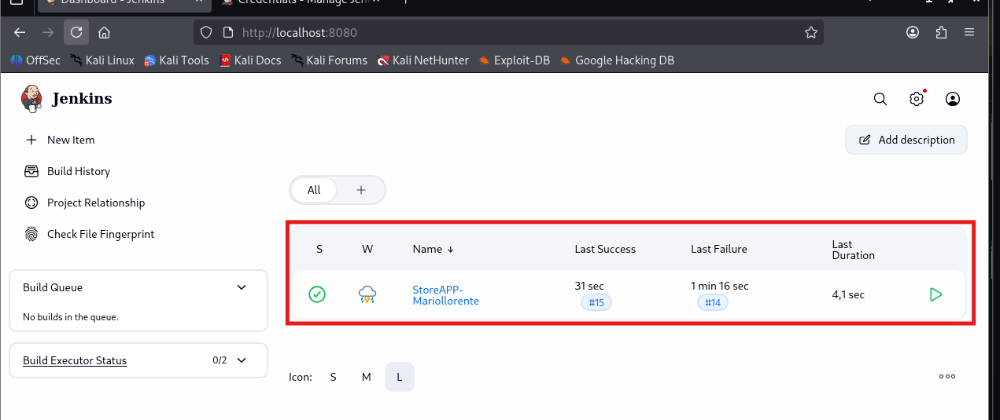


Vemos las diferentes tareas realizadas, en nuestro caso sólo una `StoreAPP-PPSvjp` vemos el nombre en la columna `nombre`.    

Veamos el resto de las columnas aparte de `nombre`:
- **S** nos indica el estado de la ejecuación: 
    - con **check en verde** indica que se **ha ejecutado sin errores**.
    - con **cruz en rojo** indica que **ha habido errores**.
- **W** indica la **estabilidad**. es decor so las últimas ejecuciones ha habido errores. El sol indica buena estabilidad.
- **Nombre**, como decíamos el nombre de la tarea ejecutada. Si pulsamos en el enlace podemos ir a la tarea. Si pulsamos en el desplegable podemos ir a diferentes acciones de la tarea:
    - **Changes**:
    - **Construir ahora**: para volver a ejecutar.
    - **Configurar**: ir a configuración.
    - **Borrar pipeline**: borrarlo.
    - **Stages**: muestra visualmente el estado de la ejecución de las diferentes etapas.
    - **Rename**: renombrar tarea.
    - **Pipeline Syntax**: ayuda de sintaxis en el script.

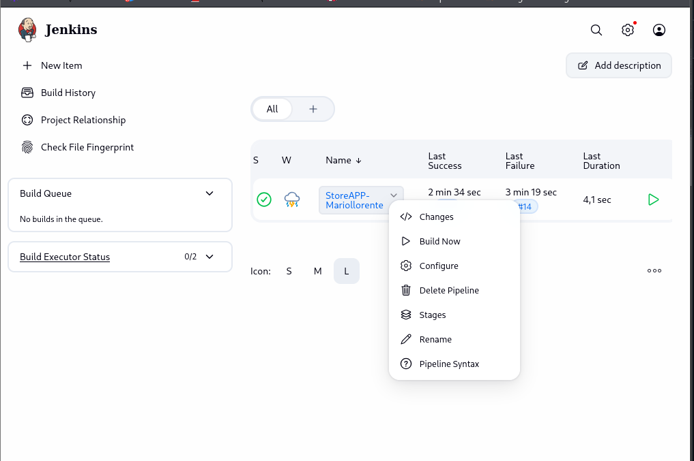


- **Último éxito**: indica cuándo se ha ejecutado la última ejecución correcta, en tiempo e identificador de ejecución(#numero).
- **Último fallo**: idem pero ejecución con error.
- **Última duración**: tiempo que duró la última ejecución.

Si pulsamos sobre nuestro pipeline nos lleva al apartado **Status** y nos aparecen las opciones indicadas en el desplegable anterior:

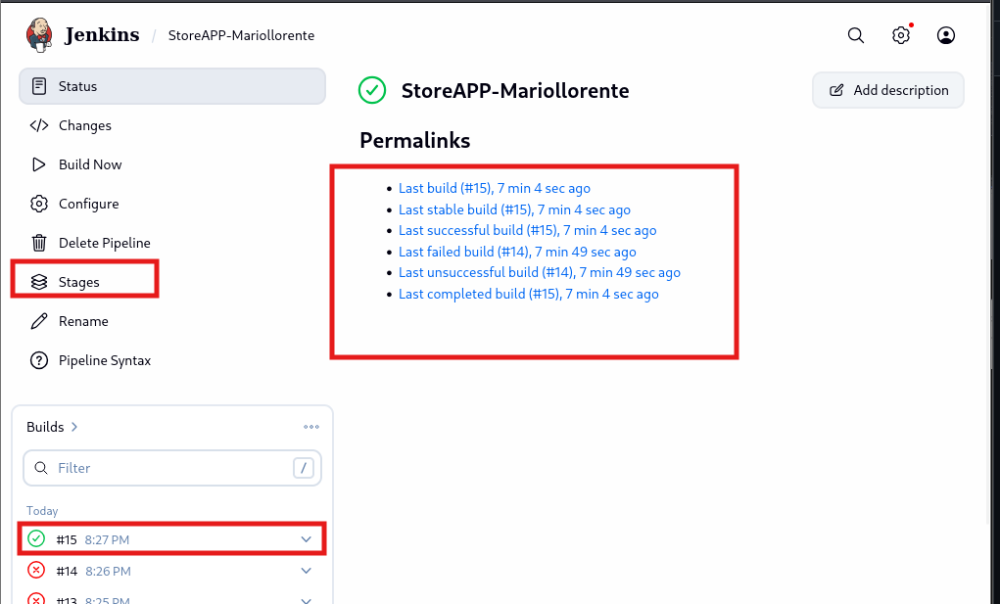


Vamos a ver cómo podemos ver con más detalle la ejecución:

En **Status** , en **Enlaces permanentes** tenemos enlace directo a las últimas ejecuciones: si hacemos clic sobre ellas nos lleva a la información de ellas.

En la parte inferior derecha, tenemos **builds** donde aparece una lista de todas las construcciones.

Pulsando sobre cualquiera de las construcciones con lleva a ellas.

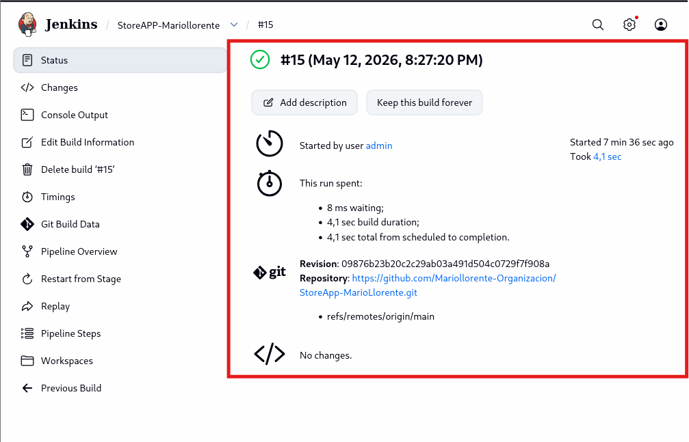


## Información sobre builds.

Aparte de la información, observa que en la parte derecha, podemos **añadir descripción** a esta ejecución y también **Conservar esta ejecución para siempre**.

Vemos las opciones que tenemos sobre un **build** en el menú lateral:
- **Status**: ya lo hemos visto. Información del estado del Build.
- **Changes**: cambios que se han producido.
- **Console output**: este es interesante ya que es la **información en el terminal** que producen la ejecución del build. Podemos copiarlo y descargarlo si es necesario.

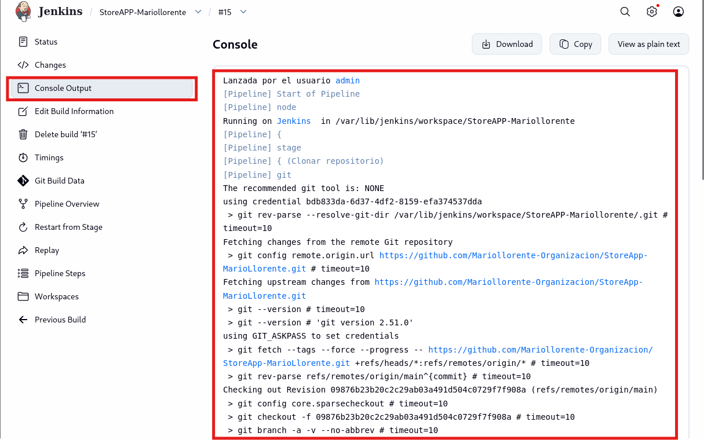


- **Edit Build Information**: por si queremos **editar el nombre del build** o añadir una descripción explícita de lo que hace.
- **Timmings**: con los tiempos de los builds, tanto ejecución como parado, etc.
- **Git Build Data**: sobre información de git (ramas afectadas, etc).
- **Pipeline Overview**: información detallada de la ejecución de los diferentes pasos.

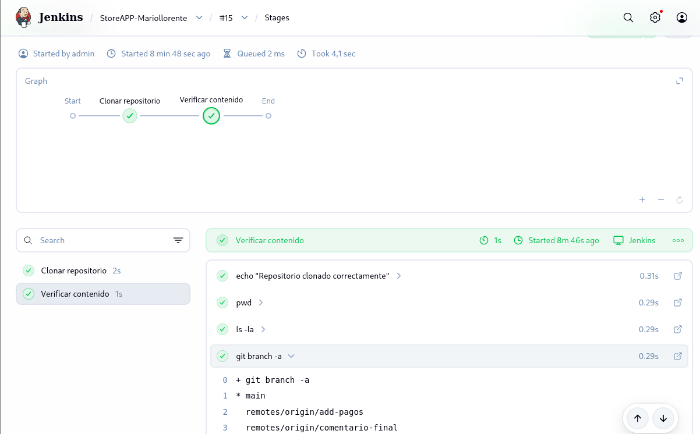

Vemos como pulsando en cada uno de los **pasos** podemos información detallada de la ejecución. Y al abrir la pestaña en cada uno de los comandos vemos el resultado de la ejecución de dicho comando.

Pulsando sobre alguno de los stages correctos podemos **ver de forma gráfica** el flujo.


- **Restart from Stage**: **ejecutar build desde el stage indicado**, es decir no lo ejecutamos completo sino desde un paso determinado.

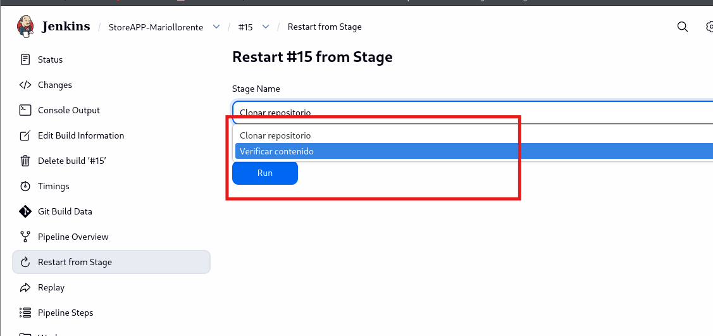


- **Replay**: **ejecutar de nuevo**, pero nos permite modificar el script que va a ejecutar. Nos puede servir para depurar.

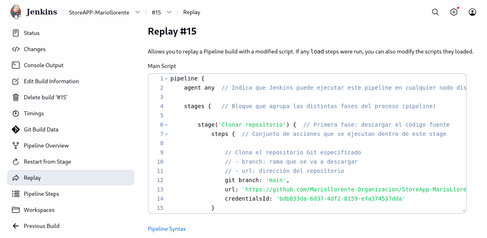


- **Pipeline Steps**: Nos muestra de forma gráfica los **diferentes Stages, Steps y comandos** en Steps ejecutados.

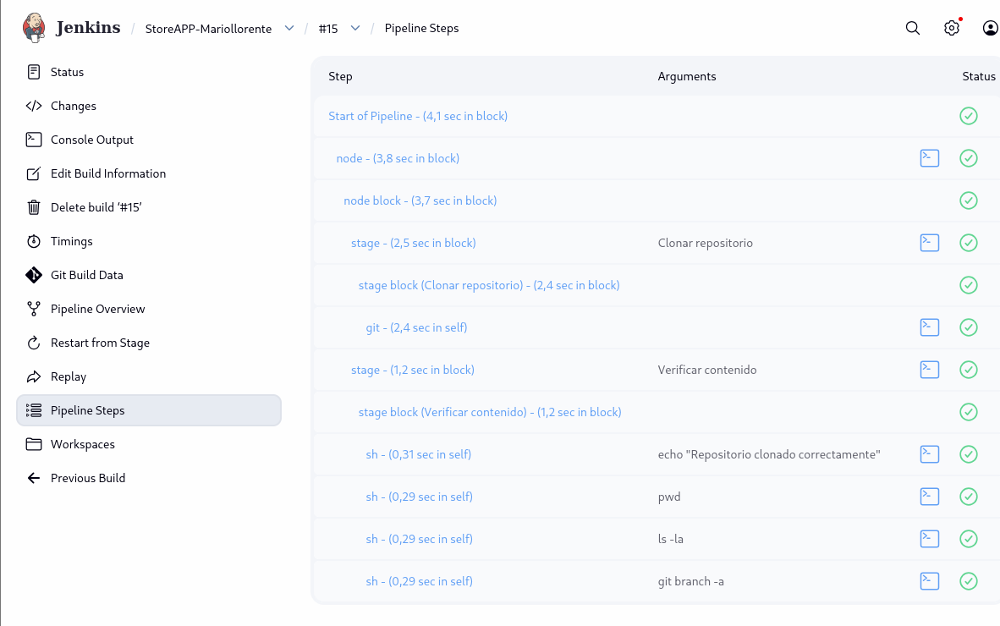


- **Workspaces**: el espacio de trabajo o espacios utilizados (Directorios).

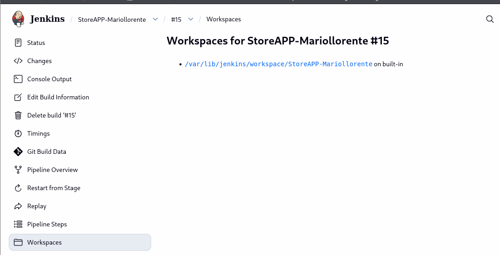


# DEPURAR ERRORES EN BUILD

Vamos a modificar el `Pipeline` para ver cómo se tratan y depuran los errores.

1. Vamos a la Tarea **StoreApp-TuNombre** y pulsas en **Configurar**

2. **Cambia el `Pipeline script`**. Aquí está el pipeline:

```groovy
pipeline {
    agent any

    stages {

        stage('Clonar repositorio') {
            steps {
                git(
                    branch: 'main',
                    url: 'https://github.com/Mariollorente-Organizacion/StoreApp-MarioLlorente.git',
                    credentialsId: 'bdb833da-6d37-4df2-8159-efa374537dda'
                )
            }
        }

        stage('Verificar contenido') {
            steps {
                sh 'echo "Repositorio clonado correctamente"'
                sh 'pwd'
                sh 'ls -la'
                sh 'git branch -a'
            }
        }

        stage('Build con Maven') {
            steps {
                withEnv(["JAVA_HOME=/usr/lib/jvm/java-11-openjdk-amd64","PATH+JAVA=/usr/lib/jvm/java-11-openjdk-amd64/bin"]) {
                    dir('store-app') {
                        sh 'mvn clean package -DskipTests'
                    }
                }
            }
        }
    }
}
```

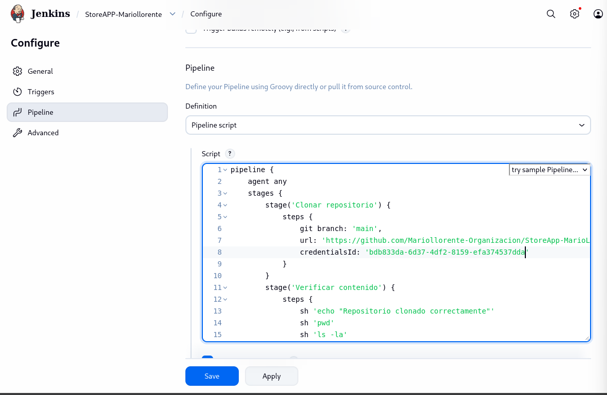

4. Pulsamos el botón **Construir ahora** para que se ejecute el `build`.

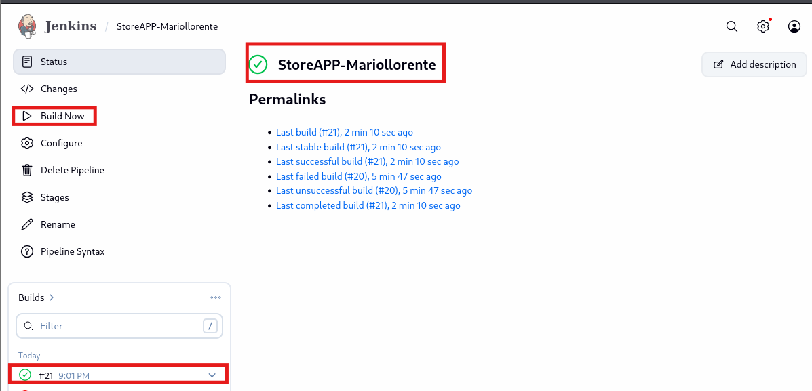

Mientras se está ejecutando podemos ver el progreso.

7. Cuando finaliza vemos como los todos los `stages` **Clonar repositorio**, **verificar contenido** y **compilar con maven** se han realizado correctamente.

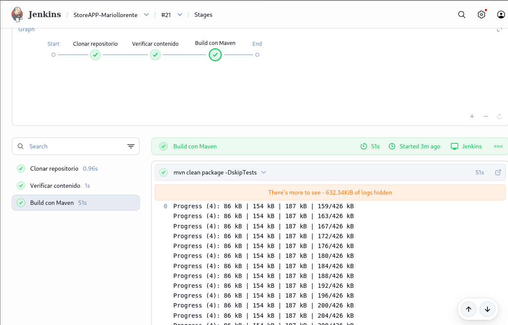

Una vez compilado el proyecto se tiene que haber generado nuestra aplicación .jar en java.

8.  Vamos a inspeccionar los archivos en nuestro área de trabajo: **StoreAPP-PPSvjp -> nº Build -> Workspace**:

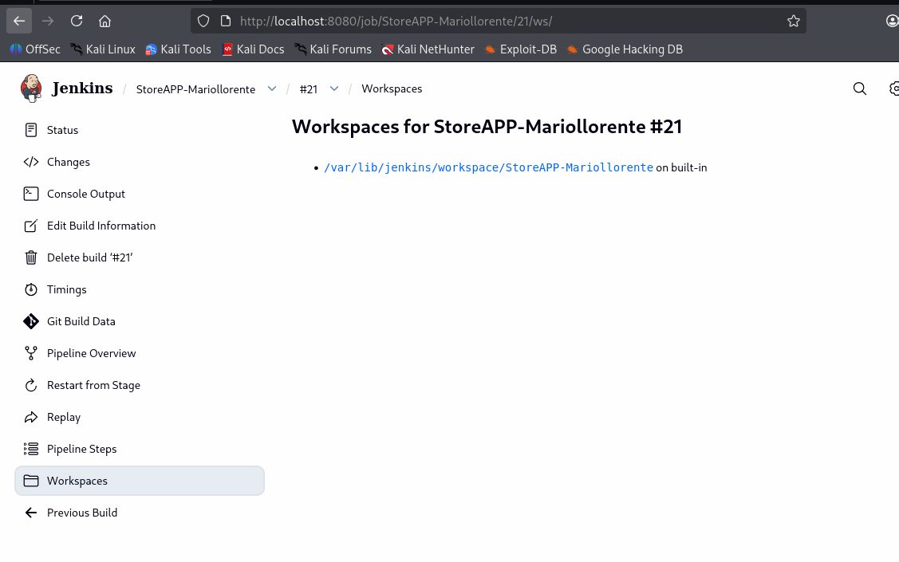

9. **Pulsamos en el enlace** del directorio de trabajo.

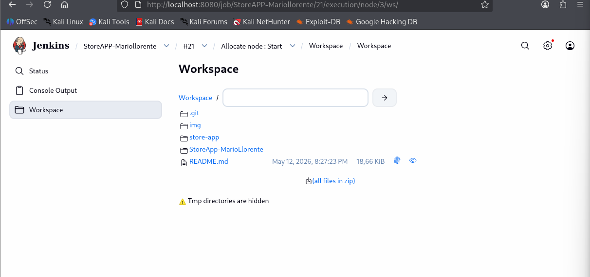

Observamos cómo se muestran todos los archivos de dicho directorio y podemos movernos entre esos directorios y deescargar los archivos que necesitemos.